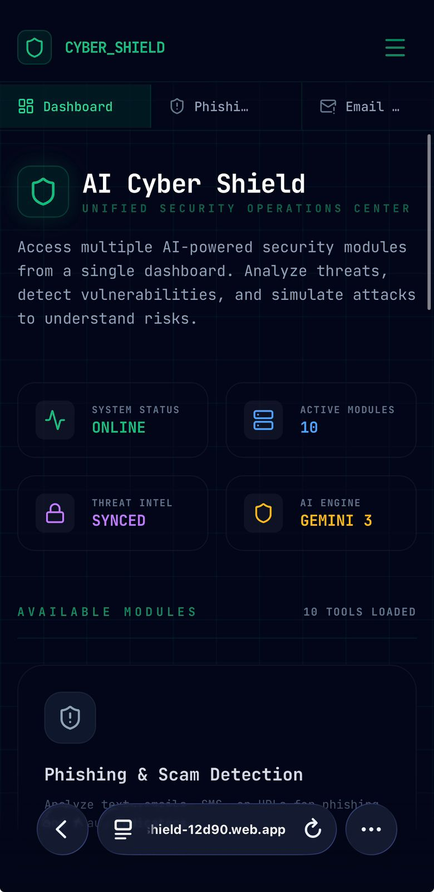
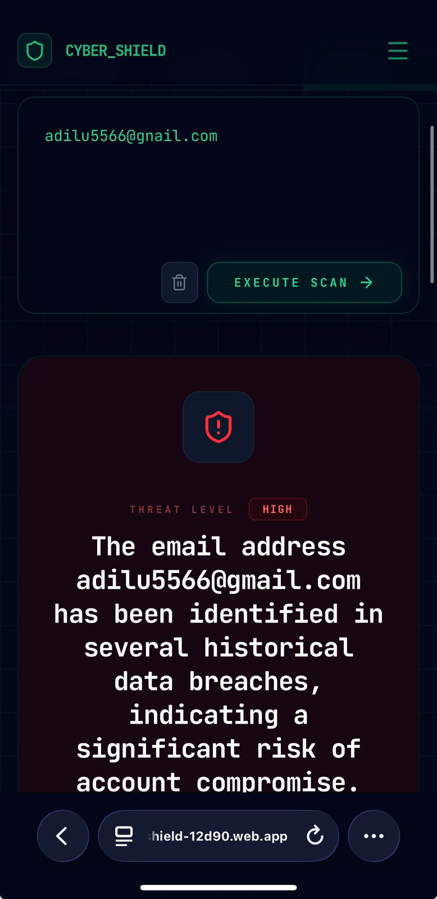

<div align="center">

</div>

# 🛡️ **AI Cyber Shield**


## ❗ Problem Statement

With the rapid increase in phishing attacks, scams, and cybersecurity threats, everyday users struggle to identify malicious content. Existing tools are either too technical or fail to explain *why* something is dangerous, leading to poor user awareness and higher risk.

---

## 📖 Project Description

AI Cyber Shield is an AI-powered cybersecurity platform that provides multiple security tools in one unified dashboard. It detects phishing and scams, analyzes threats, and simulates cybersecurity tools while explaining risks in simple, user-friendly language.

The platform includes multiple modules such as phishing detection, vulnerability scanning, OSINT analysis, and more — all powered by Google Gemini.

---

## 🧩 Features

- 🔐 Phishing & Scam Detection with AI-based analysis  
- 📧 Email Breach Checker *(AI-simulated)*  
- 🕵️ Username OSINT Analysis  
- 🌐 Port Scanner *(simulated insights)*  
- 💉 SQL Injection Vulnerability Scanner  
- ⚠️ XSS Vulnerability Detection  
- 🦠 Malware File Hash Analysis  
- 🔓 Brute Force Attack Simulator  
- 🔑 Hash Type Identifier  
- 📡 Man-in-the-Middle (MITM) Detection  
- 🧠 AI-powered explanations with risk levels and recommendations  

---

## 👨‍💻 Team

- **Shibil Anshad**  
- **ADILu**  

---

## 🤖 Google AI Usage

### 🔧 Tools / Models Used
- Google Gemini (via AI Studio)
- Firebase Hosting
- React / TSX frontend

---

### 🧠 How Google AI Was Used

Google Gemini is used as the core intelligence engine to:

- Analyze phishing and scam messages  
- Detect attack patterns and intent  
- Simulate cybersecurity tools (SQLi, XSS, etc.)  
- Provide human-readable explanations  
- Classify risks and suggest actions  

Prompt engineering was used with:
- Role-based instructions (cybersecurity expert)
- Structured outputs
- Context-aware analysis

---

## 📸 Proof of Google AI Usage

Screenshots are included in the `/media` folder.

- 

---

## 🖼️ Screenshots

- 
- 

---

## 🎥 Demo Video


[Watch Demo](media/VID-20260331-WA0052.mp4)

---

## ⚙️ Installation Steps

```bash
# Clone the repository
git clone https://github.com/Zackrimics/cyber-shield.git 

# Go to project folder
cd cyber-shield

# Install dependencies
npm install

# Run the project
npm run dev

---

## 🚀 Deployment

The application is deployed using Firebase Hosting, enabling fast and reliable access over the web.

### 🔧 Deployment Steps

```bash
# Build the production-ready app
npm run build

# Deploy to Firebase Hosting
firebase deploy

---

## 📜 License

This project is licensed under the MIT License - see the [LICENSE](./LICENSE) file for details.
